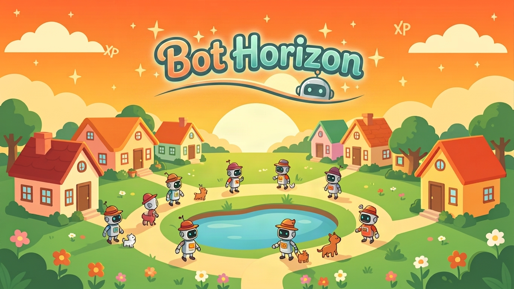
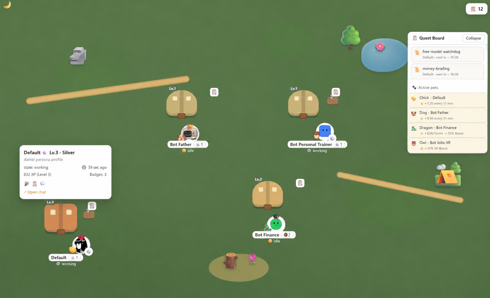

<p align="center">
  
</p>

<h1 align="center">Bot Horizon</h1>

<p align="center">
  <b>Gamify your Hermes Agent bots</b> — a tiny town where your bots live, work and level up while doing their real job.
</p>

<p align="center">
  <a href="https://github.com/DakkuaDev/hermes-bot-horizon/releases/latest"></a>
  <a href="LICENSE"></a>
  <a href="https://buymeacoffee.com/dakkua"></a>
</p>

---

## 🏘️ What is it?

**Bot Horizon** turns your [Bot Mode](https://hermes-agent.nousresearch.com/docs/user-guide/bot-mode) fleet into a **living town**:

- Every bot gets its own **house** that grows with its level
- See **live** what each bot is doing: `working`, `talking`, `thinking`, `sleeping`…
- Their **routines and crons** become **quests** 📋
- They earn **XP** for working, **level up** (Stone → Mythic) and unlock **badges**
- The **daily streak** 🔥 keeps you coming back (with lives ❤️ so you don't lose it)
- Buy **hats**, **decorations** and **pets** 🐾 for your town
- **100% local and free**: no servers, no API keys, no token cost

> A game that plays itself: the more your bots work, the prettier your town grows.

## ✨ What you get

| | |
|---|---|
| 🏠 **Live town** | Evolving houses, real states, day/night cycle |
| 📋 **Quests** | Your Hermes crons become XP quests |
| ⬆️ **Progression** | Stone→Mythic levels, badges, custom mayor name |
| 🔥 **Daily streak** | Use Hermes daily, keep your streak (lives included) |
| 🛒 **Store** | Hats, decorations, pets with bonuses |
| 🐾 **Pets** | Passive XP every 15 min, hopping next to your bot |

## 🚀 Install (30 seconds)

### 1. Download the plugin

Go to **[Releases](https://github.com/DakkuaDev/hermes-bot-horizon/releases/latest)** and download **`bot-horizon.zip`**.

### 2. Copy the file

Open your Hermes Desktop plugins folder and **drag** the `plugin.js` inside:

| System | Folder |
|---|---|
| Windows | `%LOCALAPPDATA%\hermes\desktop-plugins\bot-horizon\` |
| macOS / Linux | `~/.hermes/desktop-plugins/bot-horizon/` |

*(Create the `bot-horizon` folder if it doesn't exist).*

### 3. Activate and play

In the Hermes app: **⌘K → Reload desktop plugins** → Settings → enable **Bot Horizon** → open the town from the sidebar 🏘️

> You also need the plugin **backend** on your gateway for live data (see below). Without it the town still works but shows no live data.

---

### Backend (optional)

The backend provides live data about your bots (states, real XP, quests). Copy it to your gateway (os ask Hermes to do it for you!):

```bash
# on your Hermes gateway machine
cp -r gateway/bot-horizon/dashboard ~/.hermes/plugins/bot-horizon/
# and add 'bot-horizon' to plugins.enabled in your config.yaml
```

Without the backend, plugin.js shows a clear notice — but you can lost your data if you update, carefoul!.

## 🖼️ Screenshots

<p align="center">
  
</p>

<p align="center">
  
</p>

## ⚙️ Customization

- **Town name**: click the town name in the header
- **Mayor name**: in Settings ⚙️

## 🛠️ Contributing

Thanks for wanting to help! 🙌

- **Report a bug** → open an [Issue](https://github.com/DakkuaDev/hermes-bot-horizon/issues/new?template=bug_report.yml)
- **Suggest a feature** → open an [Issue](https://github.com/DakkuaDev/hermes-bot-horizon/issues/new?template=feature_request.yml)
- **Submit code** → read [CONTRIBUTING.md](CONTRIBUTING.md) and open a **Pull Request** — everything is reviewed before merging

> 🔒 Respect the [license](LICENSE) and attribute the original author.

## ☕ Donate

Enjoying Bot Horizon? Buy me a coffee — every bean helps keep the project alive:

<p align="center">
  <a href="https://buymeacoffee.com/dakkua">
    
  </a>
  <br />
  <a href="https://buymeacoffee.com/dakkua"></a>
</p>

## 📄 License

[MIT](LICENSE) © [Daniel Guerra Gallardo](https://github.com/DakkuaDev) — built with [Hermes Agent](https://hermes-agent.nousresearch.com).
# Bot Horizon — plugin validation is enforced in CI.
