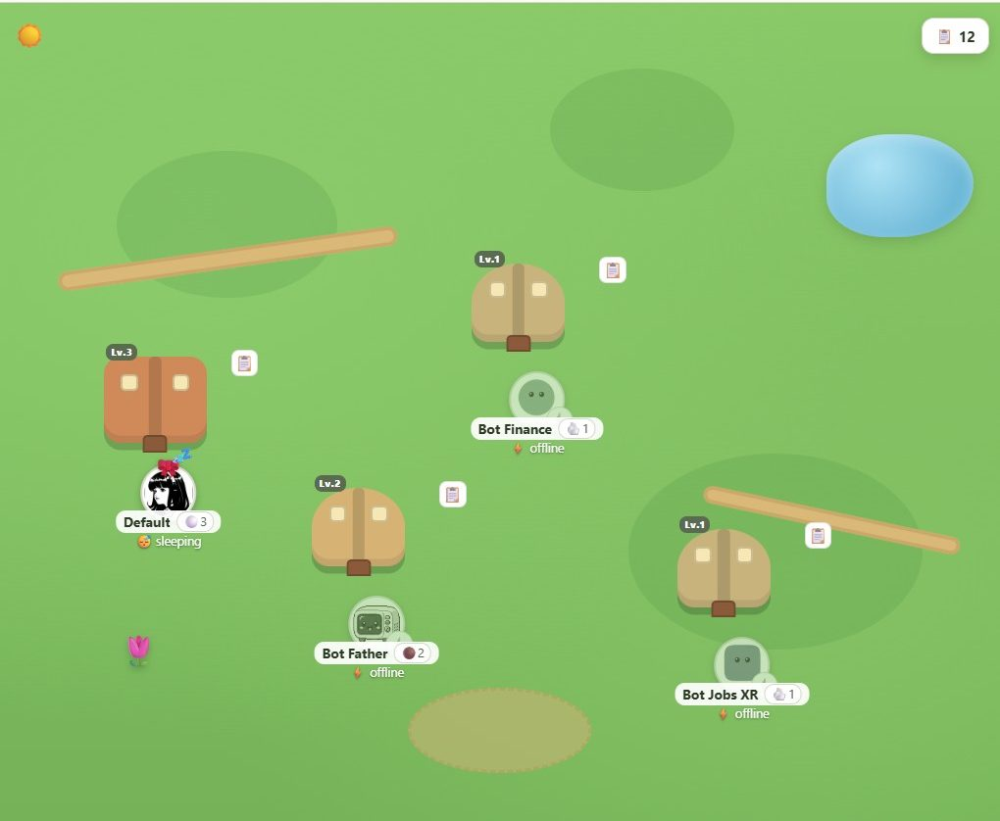
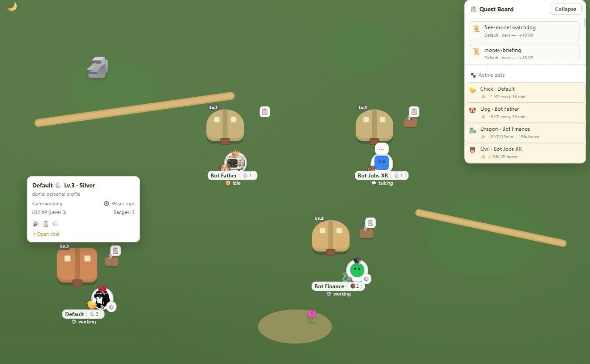
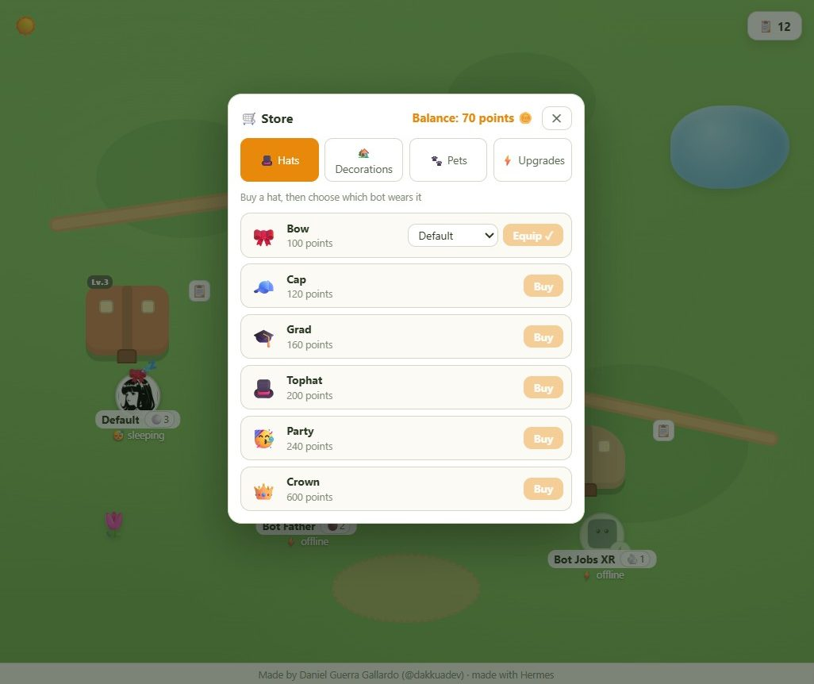
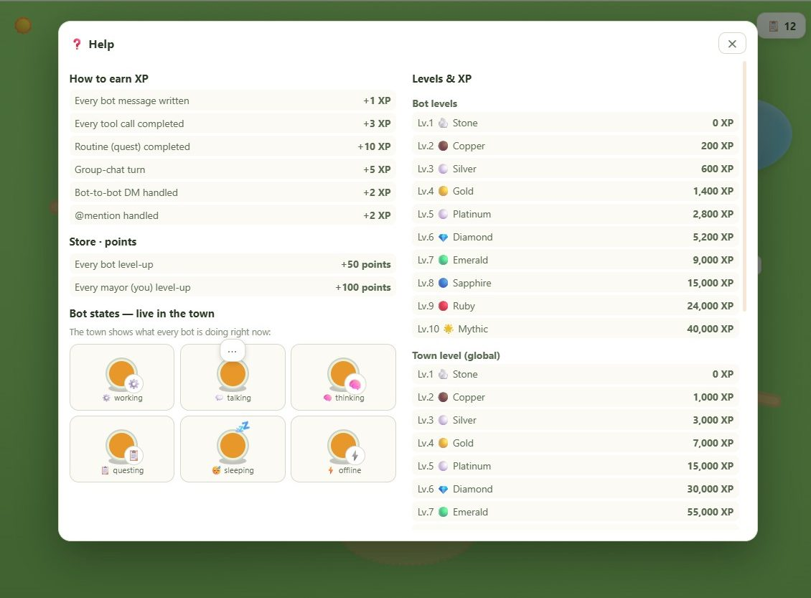

<p align="center">
  
</p>

<h1 align="center">🤖 Bot Horizon</h1>

<p align="center">
  <b>Gamifica tus bots de Hermes Agent</b> — un pueblecito donde tus bots viven, trabajan y suben de nivel mientras hacen su trabajo real.
</p>

<p align="center">
  <a href="https://github.com/DakkuaDev/hermes-bot-horizon/releases/latest"></a>
  <a href="LICENSE"></a>
  <a href="https://buymeacoffee.com/dakkua"></a>
</p>

---

## 🏘️ ¿Qué es?

**Bot Horizon** convierte tu flota de [Bot Mode](https://hermes-agent.nousresearch.com/docs/user-guide/bot-mode) en un **pueblo vivo**:

- Cada bot tiene su **casita** que crece con su nivel
- Ves **en tiempo real** lo que hace cada bot: `trabajando`, `hablando`, `pensando`, `durmiendo`…
- Sus **rutinas y crons** se convierten en **misiones** 📋
- Ganan **XP** por trabajar, suben de **nivel** (Piedra → Mítico) y desbloquean **insignias**
- La **racha diaria** 🔥 te motiva a usar Hermes cada día (con vidas ❤️ para no perderla)
- Compra **sombreros**, **decoraciones** y **mascotas** 🐾 para tu pueblo
- **100% local y gratis**: sin servidores, sin API keys, sin coste de tokens

> Un juego que se juega solo: cuanto más trabajan tus bots, más bonito crece tu pueblo.

## ✨ Lo que consigues

| | |
|---|---|
| 🏠 **Pueblo en vivo** | Casas que evolucionan, estados reales, día/noche |
| 📋 **Misiones** | Tus crons de Hermes se convierten en quests con XP |
| ⬆️ **Progresión** | Niveles Piedra→Mítico, insignias, alcalde con nombre |
| 🔥 **Racha diaria** | Motívate a usar Hermes cada día (vidas incluídas) |
| 🛒 **Tienda** | Sombreros, decoraciones, mascotas con bonos |
| 🐾 **Mascotas** | Dan XP pasivo cada 15 min y se ven saltando junto a tu bot |
| 🌍 **i18n** | Español e inglés |

## 🚀 Instalación (30 segundos)

### 1. Descarga el plugin

Ve a **[Releases](https://github.com/DakkuaDev/hermes-bot-horizon/releases/latest)** y descarga el archivo **`bot-horizon.zip`**.

### 2. Copia el archivo

Abre tu carpeta de plugins de Hermes Desktop y **arrastra** el `plugin.js` dentro:

| Sistema | Carpeta |
|---|---|
| Windows | `%LOCALAPPDATA%\hermes\desktop-plugins\bot-horizon\` |
| macOS / Linux | `~/.hermes/desktop-plugins/bot-horizon/` |

*(Crea la carpeta `bot-horizon` si no existe).*

### 3. Activa y juega

En la app de Hermes: **⌘K → Reload desktop plugins** → Settings → activa **Bot Horizon** → abre el pueblo desde la barra lateral 🏘️

> También necesitas que el **backend** del plugin esté activo en tu gateway (ver [Backend](#backend-opcional)). Sin él, el pueblo funciona pero sin datos en vivo.

---

### Backend (opcional)

El backend da datos en vivo de tus bots (estados, XP real, misiones). Cópialo a tu gateway:

```bash
# en tu máquina con el gateway de Hermes
cp -r gateway/bot-horizon/dashboard ~/.hermes/plugins/bot-horizon/
# y añade 'bot-horizon' a plugins.enabled en tu config.yaml
```

Sin backend, el plugin.js solo muestra un aviso claro — nunca crashea.

## 🖼️ Capturas

<p align="center">
  
  
  
  
</p>

## ⚙️ Personalización

- **Nombre del pueblo**: clic en el nombre en la cabecera
- **Nombre del alcalde**: en Ajustes ⚙️
- **Idioma**: español / inglés, en Ajustes

## 🛠️ Contribuir

¡Gracias por querer ayudar! 🙌

- **Reportar un error** → abre un [Issue](https://github.com/DakkuaDev/hermes-bot-horizon/issues/new?template=bug_report.yml)
- **Sugerir una mejora** → abre un [Issue](https://github.com/DakkuaDev/hermes-bot-horizon/issues/new?template=feature_request.yml)
- **Enviar código** → lee [CONTRIBUTING.md](CONTRIBUTING.md) y abre un **Pull Request** — todo pasa por revisión antes de entrar

> 🔒 **Regla de oro**: no se mergea nada a `main` sin pasar por PR revisado. Respeta la [licencia](LICENSE) y atribuye al autor original.

## ☕ Donar

¿Te gusta Bot Horizon? Invítame a un café — cada granito ayuda a mantener el proyecto:

<p align="center">
  <a href="https://buymeacoffee.com/dakkua">
    
  </a>
  <br />
  <a href="https://buymeacoffee.com/dakkua"></a>
</p>

## 📄 Licencia

[MIT](LICENSE) © [Daniel Guerra Gallardo](https://github.com/DakkuaDev) — hecho con [Hermes Agent](https://hermes-agent.nousresearch.com).
